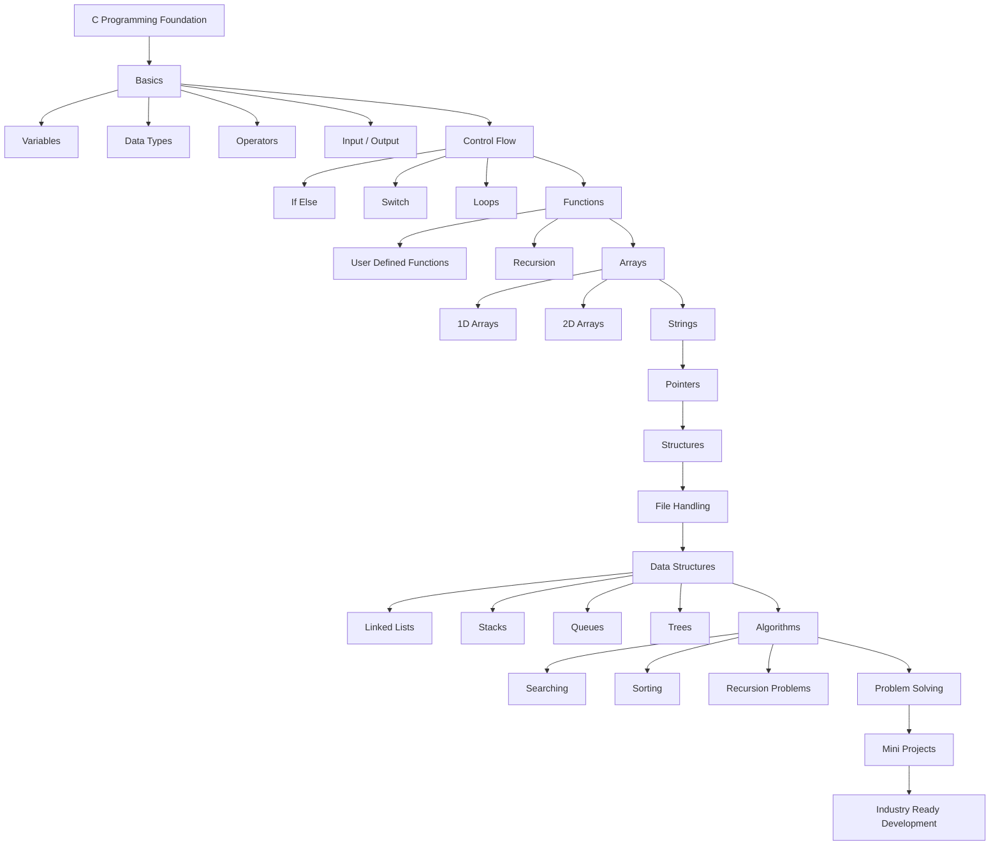
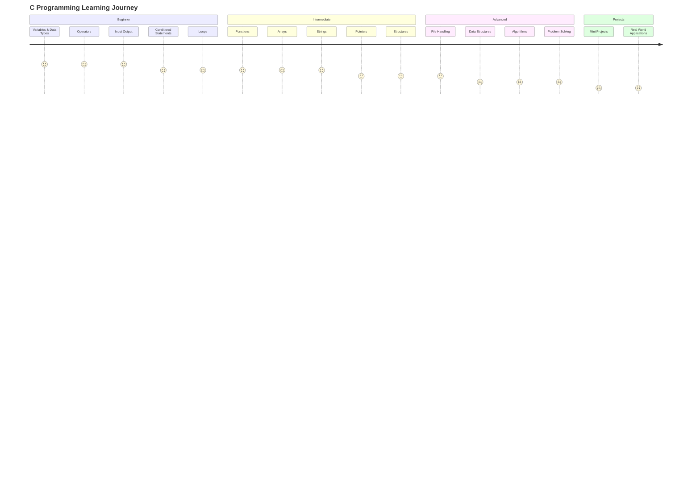
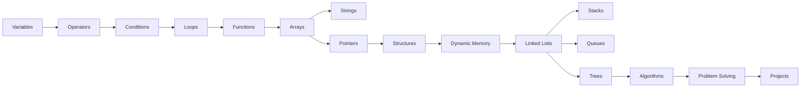
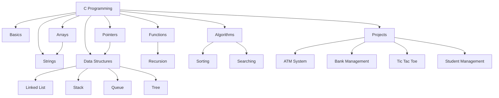
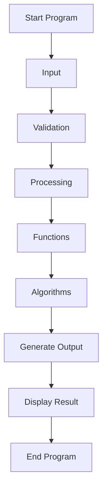
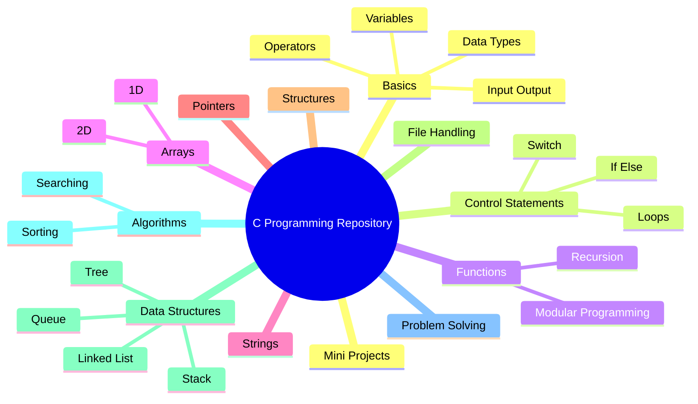
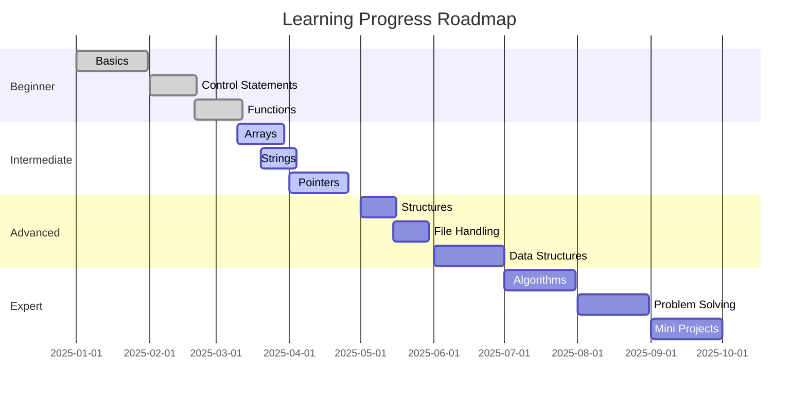
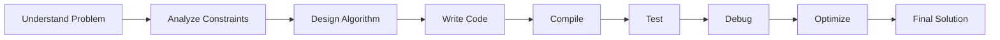

<div align="center">

<br/>

```
██████╗ ██████╗ ██╗███╗   ██╗████████╗███████╗
██╔══██╗██╔══██╗██║████╗  ██║╚══██╔══╝██╔════╝
██████╔╝██████╔╝██║██╔██╗ ██║   ██║   █████╗  
██╔═══╝ ██╔══██╗██║██║╚██╗██║   ██║   ██╔══╝  
██║     ██║  ██║██║██║ ╚████║   ██║   ██║     
╚═╝     ╚═╝  ╚═╝╚═╝╚═╝  ╚═══╝   ╚═╝   ╚═╝     
```

# From `printf()` to Problem Solving

### *A complete C programming journey — from Hello World to graph algorithms*

<br/>

<p>
  
  
  
  
  
</p>

<br/>

> **396 hand-written C programs** across **18 topic categories** — every concept learned from scratch, every algorithm built step-by-step, every mini-project coded to completion. This is not a textbook. This is a *lived learning experience* in code.

<br/>

[🗂 Browse Structure](#-complete-folder-structure) · [🗺 Learning Roadmap](#-learning-roadmap) · [📚 Topic Index](#-topic-index) · [🚀 Quick Start](#-quick-start)

---

</div>

## 📋 Table of Contents

- [From `printf()` to Problem Solving](#from-printf-to-problem-solving)
    - [*A complete C programming journey — from Hello World to graph algorithms*](#a-complete-c-programming-journey--from-hello-world-to-graph-algorithms)
  - [📋 Table of Contents](#-table-of-contents)
  - [📊 Repository Overview](#-repository-overview)
  - [🗺 Learning Roadmap](#-learning-roadmap)
  - [📁 Complete Folder Structure](#-complete-folder-structure)
  - [🔍 Folder-by-Folder Breakdown](#-folder-by-folder-breakdown)
    - [📗 Basics — The Foundation](#-basics--the-foundation)
    - [📐 Patterns — Loop Mastery](#-patterns--loop-mastery)
    - [🔢 Mathematics — Numerical Computing](#-mathematics--numerical-computing)
    - [🔄 Recursion — Functions Calling Themselves](#-recursion--functions-calling-themselves)
    - [🗃 Arrays — Data Collections](#-arrays--data-collections)
    - [🔤 Strings — Character Arrays](#-strings--character-arrays)
    - [🎯 Pointers — Memory Addresses](#-pointers--memory-addresses)
    - [🏗 Structures — Custom Data Types](#-structures--custom-data-types)
    - [💾 Dynamic Memory — Heap Allocation](#-dynamic-memory--heap-allocation)
    - [🔗 Linked Lists — Dynamic Data Structures](#-linked-lists--dynamic-data-structures)
    - [📊 Sorting — Ordering Algorithms](#-sorting--ordering-algorithms)
    - [🔍 Searching — Finding Algorithms](#-searching--finding-algorithms)
    - [🌲 Trees — Hierarchical Structures](#-trees--hierarchical-structures)
    - [🕸 Graphs — Network Algorithms](#-graphs--network-algorithms)
    - [⚡ Greedy — Optimization Algorithms](#-greedy--optimization-algorithms)
    - [🔀 Miscellaneous — Advanced Topics](#-miscellaneous--advanced-topics)
    - [🎮 Mini Projects — Applied Engineering](#-mini-projects--applied-engineering)
      - [🏧 ATM Simulation](#-atm-simulation)
      - [📇 Contact Management System](#-contact-management-system)
      - [❌⭕ Tic-Tac-Toe Game](#-tic-tac-toe-game)
      - [📅 Yearly Calendar Generator](#-yearly-calendar-generator)
    - [🔧 Functions](#-functions)
  - [📚 Topic Index](#-topic-index)
- [🏗️ Repository Architecture](#️-repository-architecture)
- [🎯 Learning Journey](#-learning-journey)
- [📚 Knowledge Dependency Map](#-knowledge-dependency-map)
- [🧩 Topic Relationship Graph](#-topic-relationship-graph)
- [⚙️ Program Execution Flow](#️-program-execution-flow)
- [🗂️ Repository Organization](#️-repository-organization)
- [🚀 Development Progress Roadmap](#-development-progress-roadmap)
- [🔄 Problem Solving Pipeline](#-problem-solving-pipeline)
  - [📈 Repository Stats](#-repository-stats)
  - [💡 Learning Philosophy](#-learning-philosophy)
  - [🚀 Quick Start](#-quick-start)
    - [Prerequisites](#prerequisites)
    - [Compile and Run](#compile-and-run)
    - [Suggested Learning Order](#suggested-learning-order)
  - [👤 Author](#-author)

---

## 📊 Repository Overview

This repository is the complete output of a structured C programming curriculum — from the very first `printf("Hello world!")` all the way to implementing Dijkstra's shortest path, Kruskal's MST, Floyd-Warshall's all-pairs algorithm, and Strassen's matrix multiplication.

Every program in this repository represents a deliberate learning step. Many topics appear in **multiple versions** (e.g., `v3`, `v7`, `v12`, `_recursive`, `_enhanced`, `_menu_driven`) — this is intentional. It captures the natural process of iterating on a solution: writing a basic version, then adding recursion, then adding formatted output, then adding a menu system. You can trace the evolution of understanding directly through the file names.

| Metric | Count |
|---|---|
| **Total C source files** | 396 |
| **Top-level topic folders** | 18 |
| **Distinct program topics** | 70+ |
| **Mini projects** | 5 |
| **Algorithms implemented** | 12+ |
| **Data structures covered** | 5+ |
| **Estimated learning hours** | 120–200 hrs |

---

## 🗺 Learning Roadmap

The curriculum follows a deliberate progression — each stage unlocks the next:

```
STAGE 1 — FOUNDATIONS
│
├── Hello World & basic I/O (printf, scanf)
├── Variables, data types, arithmetic operators
├── Conditional logic (if/else, switch)
├── Loops (for, while, do-while)
├── Finding greatest/smallest numbers
├── Integer operations (reverse, palindrome)
└── Divisibility and number patterns
│
▼
STAGE 2 — CONTROL FLOW MASTERY
│
├── Nested loops (star patterns, grid layouts)
├── Number triangle patterns (Pascal's triangle style)
├── goto-based control flow
└── Pattern generation with formatted output
│
▼
STAGE 3 — MATHEMATICAL COMPUTING
│
├── Series sums (harmonic, inverse square, cube, Taylor)
├── GCD (Euclidean algorithm)  &  LCM
├── Armstrong numbers, perfect numbers
├── Prime decomposition
├── Fibonacci, triangular, square root tables
└── Grains on chessboard (exponential growth)
│
▼
STAGE 4 — FUNCTIONS & RECURSION
│
├── Function declaration, definition, calling
├── Direct recursion (factorial, GCD, digit sum)
├── Indirect recursion (odd/even mutual calls)
├── Recursive vs iterative comparison
└── Tail recursion and stack behaviour
│
▼
STAGE 5 — ARRAYS & MATRICES
│
├── 1D arrays: insertion, duplicate detection, subset check
├── Finding second-largest without sorting
├── 2D arrays: matrix addition, multiplication
├── Matrix properties: equality, symmetry checks
└── Row-wise sorting of a matrix
│
▼
STAGE 6 — STRINGS & POINTERS
│
├── String I/O (gets, scanf, fgets)
├── String palindrome check
├── Pointer declaration, dereferencing
├── Pointer arithmetic (increment, decrement, comparison)
└── Pointer-based menu-driven programs
│
▼
STAGE 7 — STRUCTURES & MEMORY
│
├── Struct definition, member access
├── Nested structures (struct inside struct)
├── Dynamic allocation: malloc, calloc, realloc, free
├── Dynamic arrays and name storage on the heap
└── Storage classes: auto, static, extern, register
│
▼
STAGE 8 — DATA STRUCTURES
│
├── Singly linked list: insert, delete, traverse, search
├── Binary tree: in-order, pre-order, post-order traversal
└── Stack via arrays (used in sorting algorithms)
│
▼
STAGE 9 — ALGORITHMS
│
├── SORTING
│   ├── Bubble sort (ascending & descending)
│   ├── Merge sort (recursive, dynamic memory)
│   ├── Quick sort (pivot partitioning)
│   └── Radix sort (non-comparative)
│
├── SEARCHING
│   └── Binary search (iterative, with backtracking variant)
│
├── GRAPH ALGORITHMS
│   ├── Dijkstra's shortest path (single-source)
│   ├── Floyd-Warshall (all-pairs shortest path)
│   └── Kruskal's MST (union-find with greedy edge selection)
│
├── GREEDY
│   └── Activity Selection Problem
│
└── BACKTRACKING
    ├── Rat in a Maze
    └── Strassen Matrix Multiplication
│
▼
STAGE 10 — MINI PROJECTS
│
├── ATM Simulation (balance, withdraw, deposit, PIN)
├── Contact Management System (CRUD via arrays)
├── Tic-Tac-Toe Game (2-player, win detection)
└── Yearly Calendar Generator (Zeller's congruence)
```

---

## 📁 Complete Folder Structure

```text
From printf() to Problem Solving/
│
├── Organized_C_Programs/
│   │
│   ├── Basics/                          ← 58 files  │ Stage 1
│   │   ├── hello_world_basic.c
│   │   ├── hello_world_v2.c
│   │   ├── basic_io_program_basic.c
│   │   ├── basic_io_program_formatted_output.c
│   │   ├── basic_io_program_turboc_console.c
│   │   ├── basic_io_program_v2.c … v76.c
│   │   ├── finding_greatest_number_basic.c
│   │   ├── finding_greatest_number_recursive.c
│   │   ├── finding_greatest_number_v2.c … v30.c
│   │   ├── integer_palindrome_checker_basic.c
│   │   ├── integer_palindrome_checker_v2.c
│   │   ├── integer_reversal_basic.c
│   │   ├── integer_reversal_v2.c … v8.c
│   │   ├── numbers_divisibility_pattern_basic.c
│   │   ├── numbers_divisibility_pattern_v2.c
│   │   ├── smallest_number_finder_basic.c
│   │   └── smallest_number_finder_v2.c
│   │
│   ├── Patterns/                         ← 38 files  │ Stage 2
│   │   ├── nested_loop_pattern_basic.c
│   │   ├── nested_loop_pattern_formatted_output.c
│   │   ├── nested_loop_pattern_v2.c … v37.c
│   │   ├── number_triangle_pattern_v1.c
│   │   ├── number_triangle_pattern_formatted_output.c
│   │   └── number_triangle_pattern_v2.c … v52.c
│   │
│   ├── Mathematics/                      ← 54 files  │ Stage 3
│   │   ├── alternating_harmonic_series_basic.c
│   │   ├── armstrong_number_checker_basic.c
│   │   ├── divisible_by_3_and_5_summation_basic.c
│   │   ├── gcd_two_numbers_basic.c … v9.c
│   │   ├── grains_on_chessboard_basic.c
│   │   ├── inverse_cube_series_basic.c
│   │   ├── inverse_square_series_basic.c
│   │   ├── lcm_two_numbers_recursive.c
│   │   ├── multiple_mathematical_concepts_demo_*.c
│   │   ├── numeric_series_summation_basic.c … v8.c
│   │   ├── perfect_number_checker_*.c
│   │   ├── prime_sum_decomposition_*.c
│   │   ├── reciprocal_power_series_basic.c
│   │   ├── repeated_digit_series_basic.c … v7.c
│   │   ├── square_root_table_generation_basic.c
│   │   ├── sum_of_squares_series_*.c
│   │   ├── taylor_series_expansion_basic.c … v8.c
│   │   └── triangular_number_summation_basic.c
│   │
│   ├── Recursion/                        ← 38 files  │ Stage 4
│   │   ├── factorial_recursive_basic.c
│   │   ├── factorial_recursive_enhanced.c
│   │   ├── factorial_recursive_menu_driven.c
│   │   ├── factorial_recursive_v3.c … v22.c
│   │   ├── gcd_recursive_recursive.c
│   │   ├── gcd_recursive_v3.c
│   │   ├── odd_even_indirect_recursion_recursive.c
│   │   ├── odd_even_indirect_recursion_v3.c … v8.c
│   │   ├── recursive_function_demo_basic.c
│   │   ├── recursive_function_demo_v3.c … v34.c
│   │   ├── sum_of_digits_recursive_recursive.c
│   │   └── sum_of_digits_recursive_v3.c … v6.c
│   │
│   ├── Arrays/                           ← 22 files  │ Stage 5
│   │   ├── array_duplicate_finder_basic.c
│   │   ├── array_duplicate_finder_v3.c
│   │   ├── array_insertion_insertion.c
│   │   ├── array_insertion_v3.c
│   │   ├── array_subset_check_formatted_output.c
│   │   ├── array_subset_check_v3.c
│   │   ├── matrix_addition_turboc_console.c
│   │   ├── matrix_addition_v3.c
│   │   ├── matrix_equality_comparison_*.c
│   │   ├── matrix_multiplication_*.c (×4 variants)
│   │   ├── second_largest_number_finder_basic.c … v8.c
│   │   ├── symmetric_matrix_check_*.c (×4 variants)
│   │   └── row_wise_matrix_sort_*.c
│   │
│   ├── Strings/                          ← 14 files  │ Stage 6
│   │   ├── string_input_output_v3.c … v23.c
│   │   ├── string_input_output_goto_based.c
│   │   ├── string_palindrome_check_recursive.c
│   │   ├── string_palindrome_check_v3.c … v6.c
│   │   └── string_palindrome_check_goto_based.c
│   │
│   ├── Pointers/                         ← 10 files  │ Stage 6
│   │   ├── pointer_arithmetic_operations_formatted_output.c
│   │   ├── pointer_arithmetic_operations_goto_based.c
│   │   ├── pointer_arithmetic_operations_v3.c … v6.c
│   │   ├── pointer_menu_operations_demo_modular.c
│   │   ├── pointer_menu_operations_demo_recursive.c
│   │   └── pointer_menu_operations_demo_v3.c … v9.c
│   │
│   ├── Structures/                       ← 16 files  │ Stage 7
│   │   ├── nested_structure_demonstration_basic.c
│   │   ├── nested_structure_demonstration_enhanced.c
│   │   ├── nested_structure_demonstration_dynamic_memory.c
│   │   ├── nested_structure_demonstration_menu_driven.c
│   │   ├── nested_structure_demonstration_recursive.c
│   │   └── nested_structure_demonstration_v3.c … v30.c
│   │
│   ├── Dynamic_Memory/                   ← 12 files  │ Stage 7
│   │   ├── dynamic_array_multiplication_dynamic_memory.c
│   │   ├── dynamic_array_multiplication_v3.c … v8.c
│   │   ├── dynamic_name_storage_dynamic_memory.c
│   │   ├── dynamic_name_storage_v3.c … v8.c
│   │   ├── malloc_calloc_demo_basic.c
│   │   ├── malloc_calloc_demo_recursive.c
│   │   └── malloc_calloc_demo_v3.c … v7.c
│   │
│   ├── Linked_Lists/                     ← 26 files  │ Stage 8
│   │   ├── singly_linked_list_operations_basic.c
│   │   ├── singly_linked_list_operations_iterative.c
│   │   ├── singly_linked_list_operations_recursive.c
│   │   ├── singly_linked_list_operations_enhanced.c
│   │   ├── singly_linked_list_operations_menu_driven.c
│   │   ├── singly_linked_list_operations_backtracking.c
│   │   └── singly_linked_list_operations_v3.c … v52.c
│   │
│   ├── Sorting/                          ← 22 files  │ Stage 9
│   │   ├── bubble_sort_ascending_ascending.c
│   │   ├── bubble_sort_ascending_v3.c
│   │   ├── bubble_sort_descending_basic.c … v9.c
│   │   ├── merge_sort_basic.c
│   │   ├── merge_sort_recursive.c
│   │   ├── merge_sort_dynamic_memory.c
│   │   ├── merge_sort_v3.c … v11.c
│   │   ├── quick_sort_recursive.c
│   │   ├── quick_sort_formatted_output.c
│   │   ├── quick_sort_v3.c … v6.c
│   │   ├── radix_sort_recursive.c
│   │   ├── radix_sort_v3.c
│   │   └── row_wise_matrix_sort_*.c
│   │
│   ├── Searching/                        ← 16 files  │ Stage 9
│   │   ├── binary_search_iterative_iterative.c
│   │   ├── binary_search_iterative_enhanced.c
│   │   ├── binary_search_iterative_file_storage.c
│   │   ├── binary_search_iterative_backtracking.c
│   │   ├── binary_search_iterative_menu_driven.c
│   │   └── binary_search_iterative_v3.c … v30.c
│   │
│   ├── Trees/                            ←  2 files  │ Stage 8
│   │   ├── binary_tree_traversal_recursive.c
│   │   └── binary_tree_traversal_v3.c
│   │
│   ├── Graphs/                           ← 12 files  │ Stage 9
│   │   ├── dijkstra_shortest_path_v3.c
│   │   ├── dijkstra_shortest_path_formatted_output.c
│   │   ├── dijkstra_shortest_path_recursive.c
│   │   ├── dijkstra_shortest_path_v6.c
│   │   ├── floyd_warshall_all_pairs_shortest_path_recursive.c
│   │   ├── floyd_warshall_all_pairs_shortest_path_v3.c
│   │   ├── kruskal_minimum_spanning_tree_basic.c
│   │   ├── kruskal_minimum_spanning_tree_recursive.c
│   │   ├── kruskal_minimum_spanning_tree_backtracking.c
│   │   └── kruskal_minimum_spanning_tree_v3.c … v10.c
│   │
│   ├── Greedy/                           ←  4 files  │ Stage 9
│   │   ├── activity_selection_problem_recursive.c
│   │   ├── activity_selection_problem_v3.c
│   │   ├── activity_selection_problem_v4.c
│   │   └── activity_selection_problem_v8.c
│   │
│   ├── Miscellaneous/                    ← 22 files  │ Advanced
│   │   ├── rat_in_maze_backtracking_basic.c
│   │   ├── rat_in_maze_backtracking_backtracking.c
│   │   ├── rat_in_maze_backtracking_formatted_output.c
│   │   ├── rat_in_maze_backtracking_v1.c … v25.c
│   │   ├── storage_classes_demo_modular.c … v6.c
│   │   ├── strassen_matrix_multiplication_basic.c
│   │   ├── strassen_matrix_multiplication_v2.c
│   │   └── c_program_basic.c … v8.c
│   │
│   ├── Mini_Projects/                    ← 30 files  │ Applied
│   │   ├── atm_simulation_v3.c
│   │   ├── atm_simulation_goto_based.c
│   │   ├── contact_management_system_v3.c
│   │   ├── contact_management_system_array_based.c
│   │   ├── tic_tac_toe_game_v3.c
│   │   ├── tic_tac_toe_game_goto_based.c
│   │   ├── yearly_calendar_generator_v3.c … v45.c
│   │   ├── yearly_calendar_generator_zeller_algorithm.c
│   │   ├── yearly_calendar_generator_zeller_algorithm_goto_based.c
│   │   ├── yearly_calendar_generator_menu_driven.c
│   │   ├── yearly_calendar_generator_enhanced.c
│   │   └── yearly_calendar_generator_formula_based.c
│   │
│   └── Functions/                        ←  0 files  │ (folder reserved)
│
└── README.md
```

---

## 🔍 Folder-by-Folder Breakdown

---

### 📗 Basics — The Foundation
> `Organized_C_Programs/Basics/` · **58 files** · Beginner

The entry point of every C programmer. This folder captures the raw, unpolished beginning — including all the incremental revisions that show how a learner's understanding of even "simple" programs deepens over time.

**Topics covered:**

| Program | What it teaches |
|---|---|
| `hello_world` | First compilation, `printf`, return 0 |
| `basic_io_program` | `scanf`, format specifiers (`%d`, `%f`, `%c`, `%s`), type casting |
| `finding_greatest_number` | Conditional logic with `if/else`, ternary operator, recursive max |
| `smallest_number_finder` | Comparative logic with multiple variables |
| `integer_reversal` | Modulo and integer division to extract digits |
| `integer_palindrome_checker` | Reverse-then-compare technique |
| `numbers_divisibility_pattern` | Nested conditionals and loop output formatting |

**Notable variants:** `basic_io_program` appears in **30+ versions** — from raw `basic` through `turboc_console`, `file_storage`, `formatted_output`, all the way to `v76`. This reflects genuine iterative learning: each version slightly more capable or cleanly written than the last.

**Concept dependencies:** None — this is where it all starts.

**Learning outcome:** Comfortable writing, compiling, and running basic C programs with I/O and conditionals.

---

### 📐 Patterns — Loop Mastery
> `Organized_C_Programs/Patterns/` · **38 files** · Beginner–Intermediate

Nested loops are where beginners find out if they *really* understand loops. Pattern printing is the classic test: if you can control exactly which character prints at position (row, col), you understand loops.

**Topics covered:**

| Program | What it teaches |
|---|---|
| `nested_loop_pattern` | Double for-loops, space/star positioning, right-aligned triangles |
| `number_triangle_pattern` | Pascal-style numbering, row-indexed output, formatted alignment |

**Notable variants:** `number_triangle_pattern` has **52 numbered versions** — the most versioned single topic in the repo, suggesting this was particularly challenging and heavily revised.

**Concept dependencies:** Variables, loops (`for`, `while`), `printf` formatting

**Learning outcome:** Fluent control of nested loops, index-based character printing, and formatted console output.

---

### 🔢 Mathematics — Numerical Computing
> `Organized_C_Programs/Mathematics/` · **54 files** · Beginner–Intermediate

Beyond basic arithmetic. This folder covers the mathematical algorithms that appear constantly in competitive programming and numerical computing — series expansions, number theory, and combinatorics.

**Topics covered:**

| Program | What it teaches |
|---|---|
| `gcd_two_numbers` | Euclidean algorithm (iterative and recursive) |
| `lcm_two_numbers` | Relationship between GCD and LCM |
| `armstrong_number_checker` | Digit extraction with pow(), number properties |
| `perfect_number_checker` | Divisor enumeration |
| `prime_sum_decomposition` | Goldbach-style prime checking |
| `taylor_series_expansion` | Floating-point series, `math.h`, convergence |
| `alternating_harmonic_series` | Alternating signs in loop-based summation |
| `inverse_square_series` | Basel problem approximation (π²/6) |
| `inverse_cube_series` | Apéry's constant approximation |
| `reciprocal_power_series` | Generalised series computation |
| `sum_of_squares_series` | n(n+1)(2n+1)/6 verified computationally |
| `numeric_series_summation` | Generic series pattern |
| `triangular_number_summation` | n(n+1)/2 series |
| `repeated_digit_series` | Pattern-based digit repetition sums |
| `grains_on_chessboard` | Exponential growth, `unsigned long long` limits |
| `square_root_table_generation` | `sqrt()`, formatted table output |
| `divisible_by_3_and_5_summation` | Combined divisibility conditions |
| `multiple_mathematical_concepts_demo` | Combined concept showcases |

**Concept dependencies:** Loops, functions, `math.h`

**Learning outcome:** Ability to translate mathematical formulas into efficient C loops and handle floating-point arithmetic.

---

### 🔄 Recursion — Functions Calling Themselves
> `Organized_C_Programs/Recursion/` · **38 files** · Intermediate

Recursion is the conceptual leap that separates procedural thinkers from algorithmic thinkers. This folder goes deep — direct recursion, indirect recursion, tail recursion, and recursive vs iterative comparison.

**Topics covered:**

| Program | What it teaches |
|---|---|
| `factorial_recursive` | Base case + recursive case, call stack visualisation |
| `gcd_recursive` | Recursive Euclidean algorithm |
| `sum_of_digits_recursive` | Digit-by-digit recursion, `n % 10` pattern |
| `recursive_function_demo` | General recursive patterns, static variables in recursion |
| `odd_even_indirect_recursion` | Two functions calling each other — mutual recursion |

**Notable insight:** `odd_even_indirect_recursion` is the most advanced topic in this folder — it requires understanding that two functions can be mutually dependent without infinite regress.

**Concept dependencies:** Functions, return values, stack memory model

**Learning outcome:** Writing and tracing both direct and indirect recursive solutions with correct base cases.

---

### 🗃 Arrays — Data Collections
> `Organized_C_Programs/Arrays/` · **22 files** · Intermediate

Arrays are the gateway to data structures. This folder covers 1D arrays (classical problems) and 2D arrays (matrix operations), building toward the linear algebra needed for advanced algorithms.

**Topics covered:**

| Program | What it teaches |
|---|---|
| `array_insertion` | Shifting elements right, boundary handling |
| `array_duplicate_finder` | Nested-loop O(n²) duplicate detection |
| `array_subset_check` | Frequency counting and membership testing |
| `second_largest_number_finder` | Single-pass two-variable technique |
| `matrix_addition` | Element-wise operation on 2D arrays |
| `matrix_multiplication` | O(n³) dot-product loops |
| `matrix_equality_comparison` | Element-wise comparison of two matrices |
| `symmetric_matrix_check` | `matrix[i][j] == matrix[j][i]` property |
| `row_wise_matrix_sort` | Applying 1D sort to each row of a 2D array |

**Notable variants:** `matrix_multiplication` appears in **7 variants** including `_recursive` and `_multiplication_only` — exploring the evolution from basic triple-loop to cleaner implementations.

**Concept dependencies:** Loops, functions, basic I/O

**Learning outcome:** Comfortable with 1D and 2D array manipulation, index calculations, and matrix operations.

---

### 🔤 Strings — Character Arrays
> `Organized_C_Programs/Strings/` · **14 files** · Intermediate

Strings in C are just `char[]` with a null terminator — but that simplicity hides enormous complexity. This folder covers the input/output quirks and classic string problems.

**Topics covered:**

| Program | What it teaches |
|---|---|
| `string_input_output` | `scanf("%s")` vs `gets()` vs `fgets()`, null terminator |
| `string_palindrome_check` | Two-pointer technique, `strlen()`, recursive string reversal |

**Notable variants:** `string_palindrome_check_recursive.c` implements palindrome detection without any library function — pure pointer arithmetic.

**Concept dependencies:** Arrays, pointers (partial), `<string.h>`

**Learning outcome:** Safe string I/O, character-by-character manipulation, and library-free string algorithms.

---

### 🎯 Pointers — Memory Addresses
> `Organized_C_Programs/Pointers/` · **10 files** · Intermediate–Advanced

The topic that defines C. Understanding pointers means understanding how memory actually works — addresses, dereferences, pointer arithmetic, and the connection between arrays and pointers.

**Topics covered:**

| Program | What it teaches |
|---|---|
| `pointer_arithmetic_operations` | `++`, `--`, address arithmetic, pointer comparison |
| `pointer_menu_operations_demo` | Menu-driven program fully driven through pointer-to-function style, swap via pointers |

**Notable variant:** `pointer_menu_operations_demo_floyd_warshall.c` — an unusual combination that demonstrates using pointer-based data structures to implement graph algorithms.

**Concept dependencies:** Arrays, memory model, `&` and `*` operators

**Learning outcome:** Confident declaration, initialisation, arithmetic, and dereferencing of pointers.

---

### 🏗 Structures — Custom Data Types
> `Organized_C_Programs/Structures/` · **16 files** · Intermediate–Advanced

`struct` is C's answer to object-oriented data. This folder explores nesting structs inside structs — the foundation of every complex data structure in C.

**Topics covered:**

| Program | What it teaches |
|---|---|
| `nested_structure_demonstration` | `struct` definition, member access (`.`), struct arrays, nested fields |

**Key variants:**
- `_dynamic_memory` — struct instances allocated on the heap with `malloc`
- `_recursive` — struct-based recursive algorithms
- `_menu_driven` — full CRUD application using struct arrays
- `_backtracking` — struct used to represent states in a backtracking search

**Concept dependencies:** Pointers, basic I/O, functions

**Learning outcome:** Designing and using custom data types, understanding `.` vs `->` access, struct arrays.

---

### 💾 Dynamic Memory — Heap Allocation
> `Organized_C_Programs/Dynamic_Memory/` · **12 files** · Advanced

Stack vs heap. `malloc` vs `calloc`. Memory leaks. This folder is about taking control of exactly how much memory your program uses — and when.

**Topics covered:**

| Program | What it teaches |
|---|---|
| `malloc_calloc_demo` | `malloc()`, `calloc()`, `free()`, `realloc()`, NULL checking |
| `dynamic_array_multiplication` | Allocating a matrix dynamically, pointer-to-pointer (`int**`) |
| `dynamic_name_storage` | `char*` on the heap, string copying, memory management |

**Concept dependencies:** Pointers, arrays, structs, `<stdlib.h>`

**Learning outcome:** Allocating and freeing memory safely, understanding memory leaks, working with dynamically sized data.

---

### 🔗 Linked Lists — Dynamic Data Structures
> `Organized_C_Programs/Linked_Lists/` · **26 files** · Advanced

The first true data structure built from scratch. A singly linked list requires mastery of structs, pointers, and dynamic memory all at once — and is the most-versioned topic in the entire repository.

**Topics covered:**

| Program | What it teaches |
|---|---|
| `singly_linked_list_operations` | Node struct, head pointer, insert at head/tail/position |
| `singly_linked_list_operations` | Delete by value/position, traverse, search, count |
| `singly_linked_list_operations_recursive` | Recursive traversal and deletion |
| `singly_linked_list_operations_iterative` | Iterative equivalent for comparison |
| `singly_linked_list_operations_event_search` | Searching with callback-style event handling |

**Notable:** 26 versions of linked list operations — the most heavily iterated topic in the repo. Each version refines the implementation: from `_basic` (insert only) to `_enhanced` (full insert/delete/search/display/count with error handling).

**Concept dependencies:** Structs, pointers, dynamic memory (`malloc`/`free`)

**Learning outcome:** Implementing a full singly linked list from scratch, recursive and iterative approaches to list traversal.

---

### 📊 Sorting — Ordering Algorithms
> `Organized_C_Programs/Sorting/` · **22 files** · Intermediate–Advanced

Four sorting algorithms implemented in C — from the pedagogically simple (bubble sort) to the practically efficient (merge sort, quick sort) to the non-comparative (radix sort).

**Algorithms implemented:**

| Algorithm | Complexity | Key concept |
|---|---|---|
| **Bubble Sort** (ascending) | O(n²) avg/worst | Adjacent swap, early termination optimisation |
| **Bubble Sort** (descending) | O(n²) avg/worst | Reversed comparison operator |
| **Merge Sort** | O(n log n) guaranteed | Divide-and-conquer, merge step, auxiliary array |
| **Quick Sort** | O(n log n) avg, O(n²) worst | Pivot selection, in-place partitioning |
| **Radix Sort** | O(nk) | Non-comparative, digit-by-digit bucketing |
| **Row-wise Matrix Sort** | O(m × n log n) | Applying sort to 2D array rows |

**Key variants:** `merge_sort_dynamic_memory.c` allocates the auxiliary merge buffer on the heap — a real-world consideration for large datasets.

**Concept dependencies:** Arrays, recursion, dynamic memory (for merge sort)

**Learning outcome:** Understanding algorithm complexity tradeoffs, implementing O(n log n) algorithms, and choosing the right sort for the situation.

---

### 🔍 Searching — Finding Algorithms
> `Organized_C_Programs/Searching/` · **16 files** · Intermediate

Binary search — the canonical O(log n) algorithm — implemented with multiple variants including a backtracking variant that traces the search path.

**Topics covered:**

| Program | What it teaches |
|---|---|
| `binary_search_iterative` | Half-interval method, `low/mid/high` pointers |
| `binary_search_iterative_enhanced` | With boundary checks and not-found handling |
| `binary_search_iterative_backtracking` | Logging the search path as it narrows |
| `binary_search_iterative_file_storage` | Storing sorted data in files, reading back for search |
| `binary_search_iterative_menu_driven` | Interactive search with repeated queries |

**Concept dependencies:** Arrays (must be sorted), loops or recursion

**Learning outcome:** Implementing and tracing binary search, understanding the prerequisite of sorted data, O(log n) intuition.

---

### 🌲 Trees — Hierarchical Structures
> `Organized_C_Programs/Trees/` · **2 files** · Advanced

The start of hierarchical data structure work. Binary tree traversal is the gateway to understanding tree-based algorithms (BSTs, heaps, AVL trees, and more).

**Topics covered:**

| Program | What it teaches |
|---|---|
| `binary_tree_traversal_recursive` | In-order (LNR), Pre-order (NLR), Post-order (LRN) |
| `binary_tree_traversal_v3` | Same traversals with enhanced output formatting |

**Concept dependencies:** Structs, pointers, recursion, dynamic memory

**Learning outcome:** Building a binary tree with `malloc`'d nodes, recursive traversal in all three orders.

---

### 🕸 Graphs — Network Algorithms
> `Organized_C_Programs/Graphs/` · **12 files** · Advanced

Three of the most important graph algorithms in computer science, all implemented from scratch in C using adjacency matrices.

**Algorithms implemented:**

| Algorithm | Problem solved | Approach |
|---|---|---|
| **Dijkstra's** | Single-source shortest path | Greedy, priority selection from unvisited set |
| **Floyd-Warshall** | All-pairs shortest path | Dynamic programming, O(n³) triple loop |
| **Kruskal's MST** | Minimum spanning tree | Greedy edge selection + Union-Find (disjoint sets) |

**Key variants:**
- `dijkstra_shortest_path_recursive.c` — recursive formulation of Dijkstra (non-standard, educational)
- `kruskal_minimum_spanning_tree_backtracking.c` — Kruskal's with backtracking to explore MST alternatives

**Concept dependencies:** Arrays (adjacency matrix), greedy thinking, union-find data structure, dynamic programming

**Learning outcome:** Implementing weighted graph algorithms, understanding shortest-path vs MST problems, adjacency matrix representation.

---

### ⚡ Greedy — Optimization Algorithms
> `Organized_C_Programs/Greedy/` · **4 files** · Advanced

The greedy paradigm: make the locally optimal choice at each step and trust it leads to a global optimum.

**Topics covered:**

| Program | What it teaches |
|---|---|
| `activity_selection_problem` | Sort by finish time, select non-overlapping intervals, O(n log n) greedy |

**Concept dependencies:** Arrays, sorting, mathematical reasoning about optimality

**Learning outcome:** Recognising and implementing greedy algorithms, proving local choice leads to global optimum.

---

### 🔀 Miscellaneous — Advanced Topics
> `Organized_C_Programs/Miscellaneous/` · **22 files** · Advanced

The catch-all for advanced topics that don't fit neatly into one category — backtracking, storage classes, and divide-and-conquer matrix algorithms.

**Topics covered:**

| Program | What it teaches |
|---|---|
| `rat_in_maze_backtracking` | Backtracking search on a 2D grid, recursion with undo |
| `storage_classes_demo` | `auto`, `static`, `extern`, `register` — scope and lifetime |
| `strassen_matrix_multiplication` | O(n^2.807) divide-and-conquer matrix multiply |
| `c_program` | General utility / scratchpad programs |

**Notable:** `strassen_matrix_multiplication` is one of the most advanced programs in the repo — it implements the 7-multiplication divide-and-conquer method that beats naive O(n³) matrix multiplication.

**Concept dependencies:** Recursion, 2D arrays, storage classes, advanced pointer usage

**Learning outcome:** Backtracking algorithm design, understanding C's memory model via storage classes, divide-and-conquer beyond merge sort.

---

### 🎮 Mini Projects — Applied Engineering
> `Organized_C_Programs/Mini_Projects/` · **30 files** · Intermediate–Advanced

Where concepts become programs. These are complete, functional applications — not exercises, but real software built in C. Each project integrates multiple concepts learned across the curriculum.

---

#### 🏧 ATM Simulation
> `atm_simulation_v3.c` · `atm_simulation_goto_based.c`

A command-line ATM that handles balance inquiry, cash withdrawal, deposit, and PIN validation. Demonstrates menu-driven program design, persistent state via variables, and control flow with `goto` (and structured alternatives).

**Concepts integrated:** Loops, conditionals, functions, basic I/O, control flow

---

#### 📇 Contact Management System
> `contact_management_system_v3.c` · `contact_management_system_array_based.c`

A full CRUD application for managing contacts — add, view, search, delete. Stores contact records in a struct array. Demonstrates real software design in C: menu systems, struct arrays, and linear search.

**Concepts integrated:** Structs, arrays, functions, string I/O, menu-driven design

---

#### ❌⭕ Tic-Tac-Toe Game
> `tic_tac_toe_game_v3.c` · `tic_tac_toe_game_goto_based.c`

A fully playable 2-player Tic-Tac-Toe game with win detection, draw detection, and board display. The `goto_based` version uses `goto` for game-loop control — the structured version uses `while` loops and function calls.

**Concepts integrated:** 2D arrays, conditionals, loops, functions, game state management

---

#### 📅 Yearly Calendar Generator
> 20+ variants including `_zeller_algorithm`, `_menu_driven`, `_interactive_loop`, `_enhanced`

The most extensively developed project in the repository — a program that generates a formatted 12-month calendar for any year. The Zeller's Congruence variant computes the day-of-week for January 1st mathematically (no lookup tables), then prints the entire year with correct day alignment.

**Key variants:**
- `_formula_based` — pure arithmetic, no hardcoded day tables
- `_zeller_algorithm` — full Zeller's congruence implementation
- `_menu_driven` — interactive year selection with repeat-until-exit
- `_enhanced` — formatted output with month headers, day labels, proper spacing
- `_turboc_console_welcome_screen` — TurboC-era styling with ASCII welcome screen

**Concepts integrated:** Modular arithmetic, loops, arrays, formatted output, functions, interactive menu design

---

### 🔧 Functions
> `Organized_C_Programs/Functions/` · **0 files** · Reserved

This folder is reserved for future function-focused programs — modular design, function pointers, variadic functions, and header files.

---

## 📚 Topic Index

Quick lookup of every distinct concept covered in this repository:

**A** — Activity Selection Problem, Alternating Harmonic Series, Armstrong Number, Array Duplicate Finder, Array Insertion, Array Subset Check, ATM Simulation

**B** — Basic I/O, Binary Search (iterative, backtracking, file-backed, menu-driven), Binary Tree Traversal, Bubble Sort (ascending, descending)

**C** — Calendar Generator (Yearly, Zeller's), Contact Management System, C Storage Classes

**D** — Dijkstra Shortest Path, Divisibility Pattern, Dynamic Array Multiplication, Dynamic Name Storage

**F** — Factorial (recursive, menu-driven, enhanced), Finding Greatest Number, Floyd-Warshall All-Pairs Shortest Path

**G** — GCD (iterative, recursive), Grains on Chessboard, Greedy Activity Selection

**H** — Hello World

**I** — Integer Palindrome Checker, Integer Reversal, Indirect Recursion (odd/even), Inverse Cube Series, Inverse Square Series

**K** — Kruskal's Minimum Spanning Tree

**L** — LCM, Linked List (Singly — insert, delete, search, traverse, recursive, iterative)

**M** — malloc/calloc Demo, Matrix Addition, Matrix Equality Check, Matrix Multiplication (basic, recursive, Strassen), Merge Sort, Multiple Mathematical Concepts Demo

**N** — Nested Loop Patterns, Nested Structures, Number Triangle Pattern, Numbers Divisibility Pattern, Numeric Series Summation

**O** — Odd/Even Indirect Recursion

**P** — Perfect Number Checker, Pointer Arithmetic Operations, Pointer Menu Operations, Prime Sum Decomposition

**Q** — Quick Sort

**R** — Radix Sort, Rat in a Maze (backtracking), Reciprocal Power Series, Recursive Function Demo, Repeated Digit Series, Row-Wise Matrix Sort

**S** — Second Largest Number Finder, Singly Linked List Operations, Smallest Number Finder, Square Root Table Generation, Storage Classes Demo, Strassen Matrix Multiplication, String Input/Output, String Palindrome Check, Sum of Digits (recursive), Sum of Squares Series, Symmetric Matrix Check

**T** — Taylor Series Expansion, Tic-Tac-Toe Game, Triangular Number Summation

---

If you only want the **diagram sections** for your repository README (similar to the demo you shared), use these diagram categories after analyzing the repository:

---

# 🏗️ Repository Architecture



---

# 🎯 Learning Journey



---

# 📚 Knowledge Dependency Map



---

# 🧩 Topic Relationship Graph



---

# ⚙️ Program Execution Flow



---

# 🗂️ Repository Organization



---

# 🚀 Development Progress Roadmap



---

# 🔄 Problem Solving Pipeline


 

---

## 📈 Repository Stats

```
┌─────────────────────────────────────────────────────┐
│                                                     │
│   Total C files          396                        │
│   Topic folders           18                        │
│   Distinct programs       70+                       │
│   Mini projects            5                        │
│                                                     │
│   Algorithms               Sorting   × 4            │
│                            Graph     × 3            │
│                            Search    × 1            │
│                            Greedy    × 1            │
│                            Backtrack × 2            │
│                                                     │
│   Data Structures          Linked List              │
│                            Binary Tree              │
│                            Stack (via arrays)       │
│                            Adjacency Matrix         │
│                                                     │
│   Largest folder           Basics      (58 files)   │
│   Most-versioned topic     Number Triangle (52 ver) │
│   Most complex project     Calendar Generator       │
│   Most advanced algo       Strassen O(n^2.807)      │
│                                                     │
└─────────────────────────────────────────────────────┘
```

---

## 💡 Learning Philosophy

**Why so many versions of the same program?**

Every `_v2`, `_v7`, `_v23` in this repo is a real snapshot of learning. The naming convention preserves the history: you can open `factorial_recursive_v3.c` and `factorial_recursive_v22.c` side-by-side and see exactly what changed — a cleaner base case, a more readable variable name, an added input validation, or a restructured output format.

This is how programming is actually learned. Not in one perfect attempt, but in iterations, with each version a little better than the last.

**Why multiple implementation styles for the same algorithm?**

The presence of `_iterative`, `_recursive`, `_enhanced`, `_menu_driven`, and `_backtracking` variants of the same algorithm isn't redundancy — it's deliberate. Solving the same problem multiple ways is how deep understanding forms. A student who has written both `binary_search_iterative_iterative.c` and `binary_search_iterative_backtracking.c` understands binary search in a way that someone who copied a single implementation never will.

---

## 🚀 Quick Start

### Prerequisites

Any C compiler works. GCC is recommended:

```bash
# Ubuntu / Debian
sudo apt install gcc

# macOS (via Homebrew)
brew install gcc

# Windows
# Install MinGW-w64 or use WSL
```

### Compile and Run

```bash
# Clone the repository
git clone https://github.com/Jakku-Harshavardhan/From-printf-to-Problem-Solving.git
cd "From-printf-to-Problem-Solving"

# Compile any program
gcc "Organized_C_Programs/Basics/hello_world_basic.c" -o hello && ./hello

# For programs using math.h
gcc "Organized_C_Programs/Mathematics/taylor_series_expansion_basic.c" -o taylor -lm && ./taylor

# For programs using advanced graph algorithms
gcc "Organized_C_Programs/Graphs/dijkstra_shortest_path_v3.c" -o dijkstra && ./dijkstra
```

### Suggested Learning Order

If you're working through this repo as a study resource, follow the stage order in the [Learning Roadmap](#-learning-roadmap). Start with `Basics/hello_world_basic.c`, end with the Mini Projects.

For each topic, read the `_basic` version first, then compare it to the latest numbered version to see how the implementation evolved.

---

## 👤 Author

**Jakku Harshavardhan**

> *"From `printf()` to Problem Solving"* — a complete documentation of one programmer's journey through C, from the first Hello World to graph theory algorithms.

<br/>

<div align="center">

[](https://github.com/Jakku-Harshavardhan)

<br/>

*If this repository helped you study C programming, consider starring it ⭐*

---

**MIT License** · Built with persistence, curiosity, and a lot of `gcc` error messages.

</div>